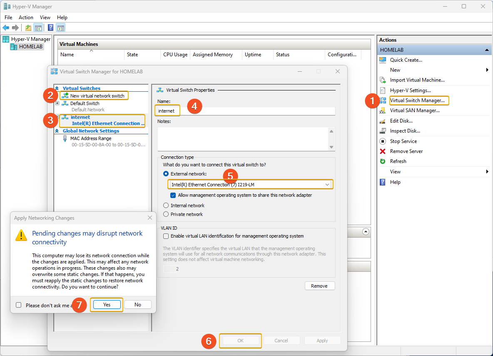

# Hyper-V Virtual Machine creation


As part of a Lab setup, I expect to create and destroy the VM's regularly.
To reduce the pain of recreating manually, I use a PowerShell script to create the Hyper-V VM's with certain specifications.

### Prerequisite
To use this script, you must have already have a working Hyper-V. You can refer to this link [Enable Hyper-V on Windows 11](https://techcommunity.microsoft.com/t5/educator-developer-blog/step-by-step-enabling-hyper-v-for-use-on-windows-11/ba-p/3745905)

Before running the script, do create a Hyper-V Virtual `External` network with the name `internet` . Ensure to match the exact name, else the PowerShell script will fail to create the `alpine1` with the correct configuration.

Refer to following screenshot for the relevant steps.

One key point to pay attention to is the step `5` ensure the selected Network has connectivity to the internet. This is key to ensure connectivity to the Internet.

 

The PowerShell script to create the VM can now be executed.

#### Download ISO files manually

In some cases the PowerShell script will fail to download the ISO files. If this occurs the Hyper-V Virtual Machines will not be created correctly.

To fix this will make the steps more complex, to avoid this download the ISO images manually.

If you ran the PowerShell script and hit the error you can restart by deleting all the Hyper-V virtual Machines and download the ISO images to the working folder `$workingfolder` set in the script.

```
# download using a browser
# save the iso to the $workingfolder\iso = "G:\kubernetes-project-lab\iso"
# download both these images
https://dl-cdn.alpinelinux.org/alpine/v3.18/releases/x86_64/alpine-standard-3.18.4-x86_64.iso
https://releases.ubuntu.com/focal/ubuntu-20.04.6-live-server-amd64.iso

```


#### PowerShell script to create Hyper-V Virtual Machines

To use this script:-
- run `Powershell ISE` as Administrator. ( Right click `PowerShell ISE` select `Run as Administrator`)

- Open the file `C:\kubernetes-lab\srv\scripts\hyper-v_Host\001-Kubernetes-Create-HyperV-VM.ps1`

- Check the work drive for `$workingfolder` to ensure the correct path is used this can be `c:\` or `d:\` depending on your configuration.

- Save any changes and click on the `Green Play` button, this will execute the script.

// method to access Video-- QR code?

[Here is a video that might help](https://clipchamp.com/watch/EYzyfDZUGRv)


#### Lessons Learned

1. Ensure the Hyper-V Virtual Switch named `internet` is created prior to executing the script. 
2. Hyper-V VM Memory needs to be at minimum 1GB. Any lower the Ubuntu will fail to install. Wasted a few days to catch this. 
3. If you are using the download ISO to memory then you need to have a minimum of 4GB on the Hyper-V VM  to load the ISO to memory. 

#### Once the Virtual Machines are created proceed to `100-alpine1-setup` steps.
