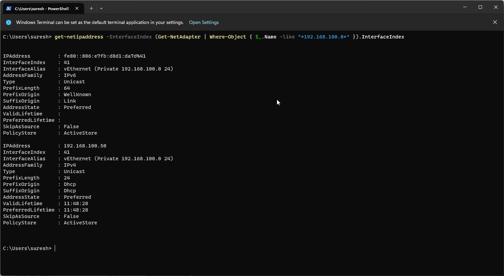

# SSH 


## Steps to ssh

In order to ssh to `alpine1` the Hyper V Host will need an IP address from the subnet `192.168.100.0/24`


> Do not use DHCP to assign the IP address , as the gateway is also assigned to my Hyper-V host Network Interface this will cause network connectivity issues. As there will be 2 gateways configured.
>
> This caused some network issues where my connection to the internet kept timing out. When I set the IP address without the Gateway the network issues were no longer present. 
> So better to set the IP address manually then obtain via DHCP.

To make it easier you can use the PowerShell script below.

Paste the following PowerShell code int Windows Terminal as Administrator.

```
$ifindex=(Get-NetAdapter | Where-Object { $_.Name -like "*192.168.100.0*" }).InterfaceIndex
New-NetIPAddress -InterfaceIndex $ifindex -IPAddress 192.168.100.2 -PrefixLength 24
Get-DnsClient -InterfaceIndex $ifindex | Set-DnsClientServerAddress -ServerAddresses ("192.168.100.1")

```

#### Validate

Run this command on Windows Terminal to check if an IP has been assigned

```
get-netipaddress -InterfaceIndex (Get-NetAdapter | Where-Object { $_.Name -like "*192.168.100.0*" }).InterfaceIndex
```



Run a ping test to `alpine1` , ensure its succesful.

```
ping 192.168.100.1
```


Troubleshooting.

- If that is working, then review the IP address ranges assigned to ensure they are correct and check for typos in the IP address.
- Ensure only one gateway IP address is assigned. Having multiple gateways will introduce connectivity issues.

## How to SSH to `alpine1` ?

Once you can ping `alpine1` you can now setup a ssh session.

Use a terminal client. Putty is a good terminal to use.
In Windows 11 as I have Terminal client installed I will be using this lab.
But any terminal program can be used.

Back to ssh from Windows terminal
I will perform further configuration from the Windows Terminal as I will be able to copy and paste commands.

From Windows Terminal type the following command. You will be presented with a login request.

```
# alpine1 IP address = 192.168.100.1
ssh -l root 192.168.100.1
Password : `123` # if the proposed Password was used
```


## You are now connected!