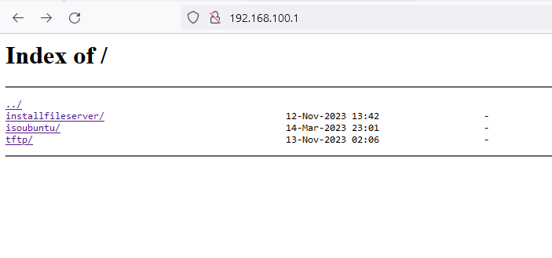
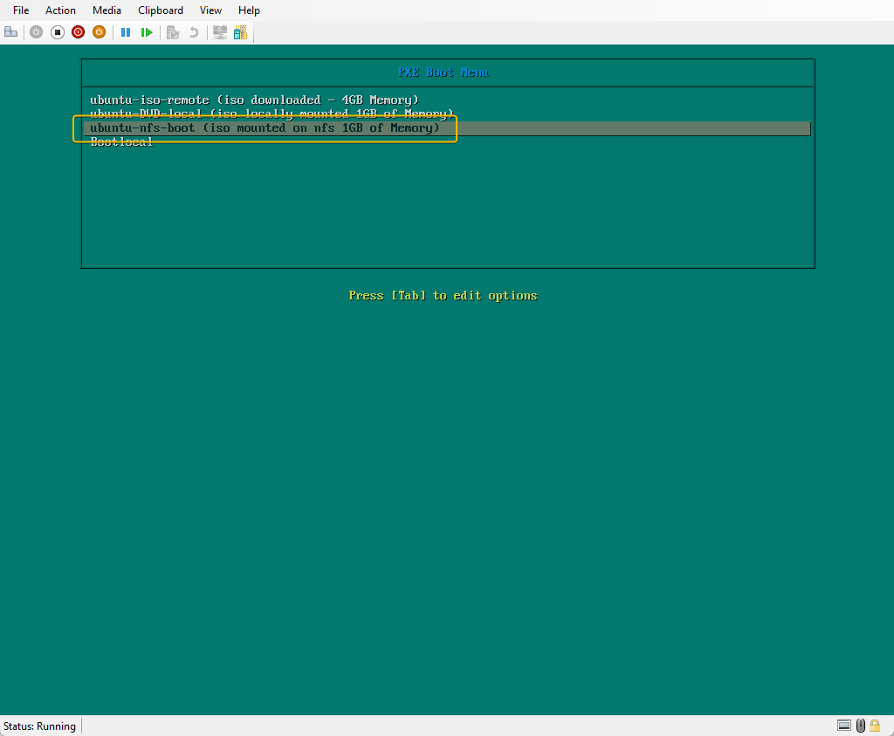

# Validate Ansible setup


To validate the services setup in `step 103` can be complicated for some services. 

The best way is when the remaining Hyper-V Virtual Machines are setup with Ubuntu.  Here are the points of reference for each service installed


1. DHCP 

   The Virtual Machines will be assigned 

   - IP address 

   - Will be provided with the tftp server information.

Success is determined when the Virtual Machine is booted up correctly to the PXE Boot Menu.

​     

2.  Router function

   - The key for this service is Internet connectivity from the remaining Virtual Machines. If the Virtual Machines return errors connecting to Internet sites, then check this configuration.

3. DNS 

   DNS can be tested when all the Virtual Machines setup are completed

   ```
   # from aLpine1 run the PING command to check Name server lookup. 
   ping alpine1
   ping loadbalancer
   ping master1
   ping master2
   ping master3
   ping worker1
   ping worker2
   ping worker3
   ping xsinglenode
   ```

   

4. Nginx Web server

   This is easy to check , from your Windows computer ( Where Hyper-V is installed) open a Web browser and type in this address.

   ```
   https://192.168.100.1
   ```

   You will be presented with a page as follows

   

5.  NFS

   The NFS  functionality is validated when you setup Ubuntu using the  option `ubuntu-nfs-boot (iso mounted on nfs 1GB of Memory)`

6. tftp

   tftp is very difficult to troubleshoot. The best way is to ensure the configuration is correct. 

   When I had issues with tftp , reviewing the tftp related configuration ( i.e. tftp server running and paths correctly configured). If you used the standard configuration without changes you should not have any issues.

   If you are presented with the following menu, then tftp is working. 

   When you press enter to select the option and the installation proceeds, then NFS is also working.

