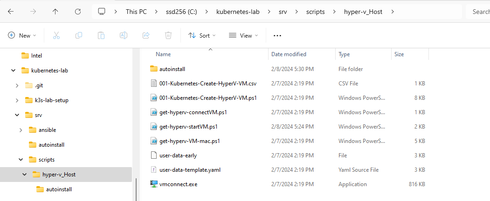
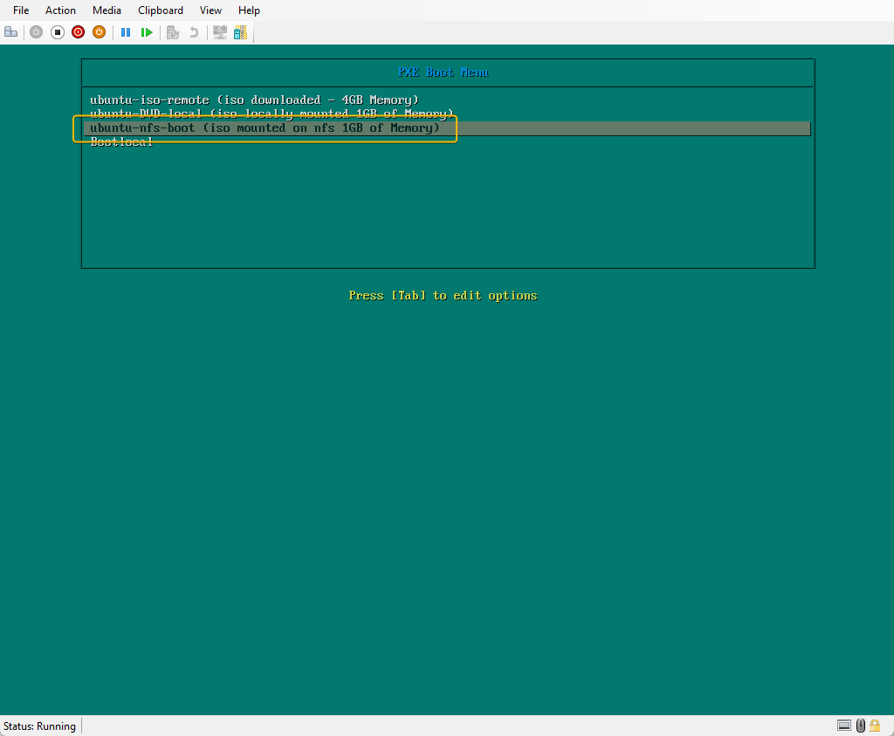

# Ubuntu Installation

Step `103-setup-using-ansible` would have setup `alpine1` to perform the functions required for the Ubuntu Auto install steps.

We now have some manual tasks to create the `user-data-mac-address` file for each of the Virtual Machines created ( excluding `alpine1`)


### Step 1

#### Start and stop all the Virtual Machines created.

For the following step, the Virtual Machines created must be started once to generate the mac-address.

From PowerShell ISE ( **as Administrator**)  open `G:\kubernetes-lab\srv\scripts\hyper-v_Host\get-hyperv-start-stopVM.ps1`

Click on the `Green Play` button, this will execute the script.

This will start and then stop all the Virtual Machines ( Load⁎ , master⁎ , worker⁎  , ⁎single⁎  ). Ensure the Virtual Machine names are not changed. 

You can also Start and Stop from the Hyper-V Console. 


### Step 2

#### Generate user-data-mac-address file.

For a Kubernetes cluster we will need multiple Virtual Machines. This will require multiple `user-data-mac-address` files to be created. Here I use PowerShell to generate the files.

From PowerShell ISE  open `G:\kubernetes-lab\srv\scripts\hyper-v_Host\get-hyperv-VM-mac.ps1`

Click on the `Green Play` button, this will execute the script.

The generated files are in the subfolder  `.\autoinstall\`




From the configuration in step `111-setup-boot-files-part3-pxelinux.cfg`  ( refer to manual step 11) , the Boot sequence is looking up the location. `http://192.168.100.1/autoinstall/`

This is from the following code

```
APPEND netboot=nfs boot=casper root=/dev/nfs nfsroot=192.168.100.1:/srv/isoubuntu autoinstall 
```

### Step 3

#### Copy autoinstall files to `alpine1`

Using [WinSCP](https://winscp.net/eng/download.php) copy the files created to the folder  `/srv/autoinstall/` on the `alpine1` server. The duplicate file with the node name is workaround to show the hostname of the specific file. 

1. WinSCP is connected to `alpine1` via IP `192.168.100.1`
2. Ensure the path to the `user-data-*` files are correct.
3. The destination path on `alpine1` is equally important.


From step `104-setup-nginx`( refer to manual steps), the folder /srv/ was exposed to be visible from `http://192.168.100.1/`. All folders created in `/srv/` will be listed via the browser.

Validate by browsing `http://192.168.100.1/`


### Step 4

#### Ubuntu installation

Ubuntu Installation on the Hyper-V Virtual machines can now begin.

1. Connect to  Hyper-V Virtual Machine `loadbalancer`

2. Start Hyper-V Virtual Machine `loadbalancer`

3. If all configuration is correct, the PXE boot menu will be presented.
    Use the arrow key to highlight the menu option `ubuntu-nfs-boot` and press enter. The Ubuntu Installation will begin. No input required.




### Step 5

#### Connect to `loadbalancer`

The DNS lookup will only work from `alpine1` , if you connect from the Windows PC then you will need to use the IP address of `loadbalancer`

Check connectivity From `alpine1` to the newly installed `Ubuntu`

```
ping loadbalancer
```


Connect/ssh  to `loadbalancer`

1. Connect from `alpine1`
2. type `ssh ubuntu@loadbalancer`
3. Connected to `loadbalancer` as reflected in the IP address.
4. The login prompt shows the user `ubuntu` logged on to `loadbalancer`


Repeat steps for remaining Hyper-V Virtual Machines.


#### Lessons Learnt

- The MAC addresses for a newly created Hyper-V Virtual Machine is not generated until its started at least once. 
- the `meta-data` and`vendor-data` while empty must exist.


