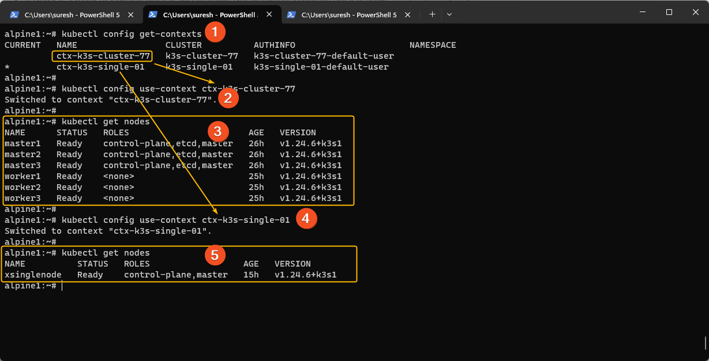

# Setup k3s with Ansible
Setting up a single node k3s is very quick , takes about 2-3 minutes to setup. Setting up a k3s High Availability cluster is more complex.

Having the goal of getting a Kubernetes Lab setup quickly, the best option I had was to use Ansible.  I have playbooks to setup one k3s High Availability Clusters and a single node k3s. Managing the k3s is best to be remote, to accommodate that, made the `alpine1` the kubectl management server. 

The most challenging task I faced when I started with kubernetes was the KUBECONFIG . Once I had this working learning the other tasks were that much easier. The Playbook and bash scripts make this easier for you.  

The following describes the fastest way to setup all the servers with the required modules and k3s.


```
execute the playbook run from `/srv/ansible/playbook-k3s/`
ansible-playbook k3s-complete-setup.yml  --user ubuntu --ask-become-pass  -i hosts.ini
```

Do repeat the ansible command if there are any errors. The script should not return any errors.


Once the above update the  DNS resolver to use `192.168.100.1`

```
#on alpine1 only.
vi /etc/resolve

nameserver 192.168.100.1
search k8s.lab

#in my case the every time the alpine1 is rebooted the values in this file get reset.
# as such the following is to set the immutable flag 

#enables readonly
chattr +i /etc/resolv.conf 

#disables readonly
chattr -i /etc/resolv.conf 
```


Once the steps are completed , `alpine1` can be configured to connect to the `k3s` clusters. 


#### Kubeconfig on `alpine1`

Once the scripts `02z-k3s-copy-kubeconfig.yml` and `03z-k3s-copy-kubeconfig-single.yml` are completed. The playbook copy the remote kubeconfig files from the remote servers . The files will be stored in `/root/.kube/clusters`  folder. 

The ansible script `k3s-complete-setup.yml ` will also copy the `KUBECONFIG` files to `alpine` and update `~/.kube/config`  to list the clusters. 


 We now need to have the KUBECONFIG setup on `alpine` . The following will merge all `*.yaml` files in `/root/.kube/clusters`

To manually setup the `KUBECONFIG` run this script.

```
 export KUBECONFIG=$(for YAML in $(find ${HOME}/.kube/clusters -name '*.yaml') ; do echo -n ":${YAML}"; done)
```


#### `kubectl` basic commands

Running some basic `kubectl` commands.

List of contexts. 

```
(1) kubectl config get-contexts.
```

Change context

```
(2) and (4) kubectl config use-context <context name>
```

List kubernetes nodes

```
(3) and (4) kubectl get nodes
```


Here is a screenshot that will provide some perspective




